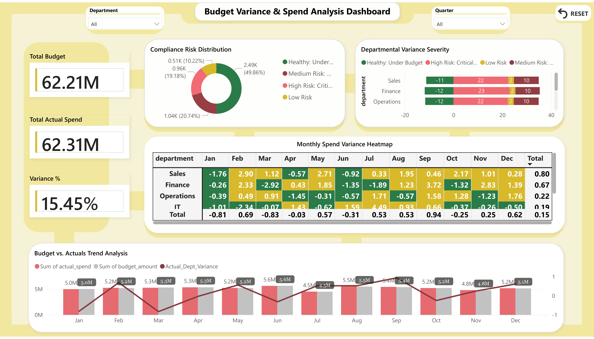
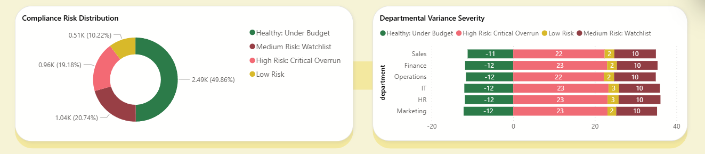
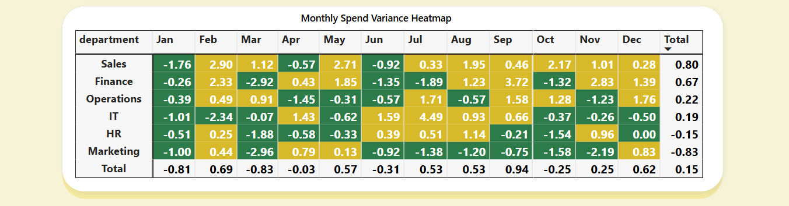
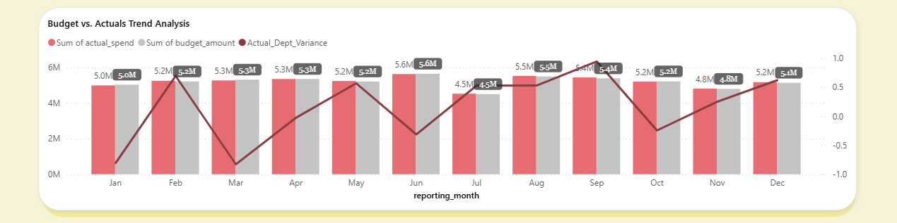

# 📊 Corporate Financial Audit & Risk Dashboard

### Project Overview
**Role:** Data Analyst | **Tools:** SQL (MySQL), Power BI, DAX

This project is an end-to-end business intelligence solution designed to monitor financial health across 5 key departments. It analyzes over 5,000 budget records to detect variance anomalies and flag critical "risk" areas (Over budget > 15%).

### 📸 Dashboard Preview


---

### 🔍 Key Features
* **Risk Flagging System:** Engineered SQL logic to categorize variances into "Healthy" (Green), "Watchlist" (Yellow), and "Critical" (Red).
* **Interactive Heatmap:** A custom variance matrix allowing auditors to spot specific months of failure instantly.
* **Dynamic Filtering:** Users can slice data by Quarter (Q1-Q4) and Department using the custom app-style navigation bar.
* **Trend Analysis:** Tracking budget vs. actuals over time to identify seasonal spending spikes.

### 🛠️ Technical Workflow
1. **Data Extraction:** Connected Power BI to a local **MySQL** database.
2. **SQL Logic:** Engineered the "Risk Status" column (High/Medium/Healthy) in SQL using `CASE` statements to calculate risk categories.
3. **DAX Calculations:** Created measures for `Variance %`, `Total Spend`, and `Risk Status`.
4. **UI/UX Design:** Built a custom "Glassmorphism" background layout for a modern, app-like feel.

---

## 🔎 Visual Breakdown & Logic

### 1. Key Performance Indicators

**Business Question:** "What is the total financial variance?"
* **Total Budget vs. Actual Spend:** Instantly compares the **$62.21M** allocated vs. **$62.31M** spent.
* **Variance %:** Calculates a **15.45%** variance, immediately signaling to management that the total actual spending has exceeded the planned budget.
  
### 2. Compliance Risk & Departmental Severity

**Business Question:** "How frequent are the risks, and which department is responsible?"
* **Compliance Risk Distribution:** Visualizes that while half the audits are "Healthy" (Green), **20%** are in "Critical Overrun" (Red).
* **Departmental Variance Severity:** The chart shows that all departments have nearly the same number of 'High Risk' audits, which means the overspending problem is happening everywhere, not just in one specific team.
  
### 3. Monthly Spend Variance Heatmap

**Business Question:** "When exactly did the budget failure happen?"
* **Technique:** Used Conditional Formatting to create a high-contrast heatmap.
    * **Green:** Under Budget
    * **Yellow:** Watchlist (0-15%)
    * **Red:** Critical (>15%)

### 4. Budget vs. Actuals Trend Analysis

**Business Question:** "Is this a seasonal anomaly?"
* **Design:** Overlays Actual Spend (Red/Grey bars) against the Budget Baseline (Grey background).
* **Insight:** The trend line shows a pattern where risks spike in the middle of each quarter (like Feb and May) and drop by the end. However, December is the exception, showing the biggest spending rush of the entire year.

---

### 💻 SQL Logic Snippet
The core of the analysis relies on a custom risk classification algorithm using `CASE` statements in SQL:

```sql
/* Categorizing Risk Levels based on Variance % */
CASE 
    WHEN (actual_spend - budget_amount) / budget_amount >= 0.15 THEN 'High Risk'
    WHEN (actual_spend - budget_amount) / budget_amount >= 0 THEN 'Medium Risk'
    ELSE 'Healthy'
END AS audit_status

